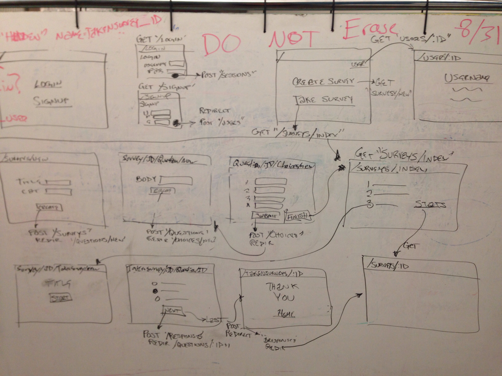

# Survey Pony
## A Survey Monkey Clone

#### To Use Survey Pony

Follow these instructions:

Clone the repo in your terminal
`bundle install` 
`bundle execute rake db:create`
`bundle execute rake db:migrate`
`bundle execute rake db:seed`
`bundle execute shotgun` to start the server
Open your browser and go to your local host. By default shotgun uses `localhost:9393/`

#### Routes
Use these routes for reference.

|                               | Verb   | URL                            | Controller#Action   |
|-------------------------------|--------|--------------------------------|---------------------|
| Home Page                     | GET    | /                              |                     |
| Login Page                    | GET    | /login                         |                     |
| Signup Page                   | GET    | /signup                        |                     |
| Create a new session(login)   | POST   | /sessions                      | session#create      |
| Delete a session(logout)      | DELETE | /sessions/:id                  | session#destroy     |
| Show a user profile page      | GET    | /users/:id                     | users#show          |
| Create a new user             | POST   | /users                         | users#create        |
| List all surveys              | GET    | /surveys                       | surveys#index       |
| Page for creating new survey  | GET    | /surveys/new                   | surveys#new         |
| Page showing stats for survey | GET    | /surveys/:id                   | surveys#show        |
| Create a new survey           | POST   | /surveys                       | surveys#create      |
| Show a question for a survey  | GET    | /takensurvey/:id/questions/:id | questions#show      |
| Page for a new question       | GET    | /survey/:id/questions/new      | questions#new       |
| Create a new question         | POST   | /questions                     | questions#create    |
| Page for new choices          | GET    | /questions/:id/choices/new     | choices#new         |
| Create new choices            | POST   | /choices                       | choices#create      |
| Create a response             | POST   | /responses                     | responses#create    |
| Create a new taken_survey     | POST   | /takensurveys                  | takensurveys#create |
| Show page for taken survey    | GET    | /survey/:id/takensurveys/new   | takensurveys#new    |
| Show thank you page           | GET    | /takensurveys/:id              | takensurveys#show   |

### Wireframe

